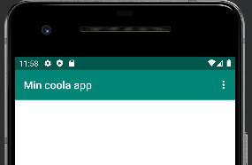
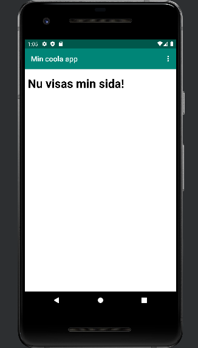
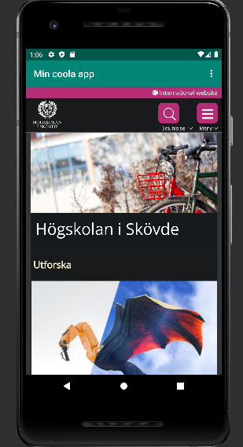
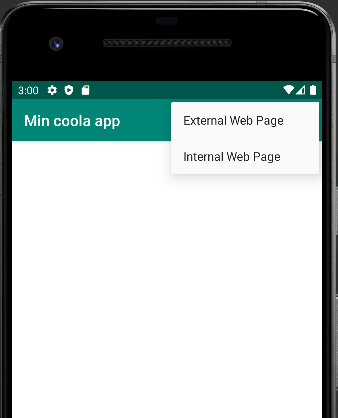

# Rapport

**Skriv din rapport här!**

Namnet på appen förändrades i strings.xml filen genom att ändra på taggen med attributen "name='app_name'". Den nya koden blev som följande: 

```
<resources>
    <string name="app_name">Min coola app</string>
    . . .
</resources>
```
Resultat syns längst upp i appen: 



För att få åtkomst till internet implementerades en ny tagg i AndroidManifest-filen. 
Denna tagg är <uses-permission> och kan ses i kodsnutten nedan. Koden skapar ingen särskild 
visuell förändring förens appen börjar använda internet. 

```
<manifest xmlns:android="http://schemas.android.com/apk/res/android"
    package="com.example.webviewapp">
    <uses-permission android:name="android.permission.INTERNET"/>
. . .
</manifest>
```

WebView-elementet skapades i activity_main genom att byta ut textview. 
Elementet fick nytt id enligt beskrivning (my_webview) och nya constraints. 
För att webview-elementet ska kunna täcka nästan hela skärmen har den begränsats till 
skärmens kanter med undantaget att toppen av webview-elementet begränsas till 
botten av navigation bar. Bredden och höjden får samma värde på 0dp, vilket betyder att elementet
tar all plats inom dess begränsningar. Kodsnutt ses nedan. 

```
    <WebView
        android:id="@+id/my_webview"
        android:layout_width="0dp"
        android:layout_height="0dp"
        app:layout_constraintBottom_toBottomOf="parent"
        app:layout_constraintEnd_toEndOf="parent"
        app:layout_constraintStart_toStartOf="parent"
        app:layout_constraintTop_toBottomOf="@+id/appBarLayout" />
```

En private member webview variabel skapas i mainActivity.java och kopplas till webview-elementet
från activity_main.xml via dess id (my_webview). Koden för detta ses nedan. 

```
public class MainActivity extends AppCompatActivity {
    private WebView myWebView;
	. . .
    @Override
    protected void onCreate(Bundle savedInstanceState) {
	. . .
        myWebView = findViewById(R.id.my_webview);

```

En ny webviewclient skapas samt kopplas till webview:en i samma rad av kod.
```
myWebView.setWebViewClient(new WebViewClient());
```

För att kunna möjliggöra användning av JavaScript tas websettings för webview:en fram. 
Dessa settings hämtas via getSettings(), därefter specificeras det att JavaScript för webview:en
ska möjliggöras med webSettings.setJavaScriptEnabled(true). Koden ses nedan. 

```
        WebSettings webSettings = myWebView.getSettings();
        webSettings.setJavaScriptEnabled(true);
```

Ännu visar webview:en ingen särskild webbsida, men detta förändras med funktionerna showExternalWebPage()
och showInternalWebPage(). I showInternalWebPage() specificeras det att en internal webbsida ska
visas vid anrop. Sidan skapas som "website.html" och läggs in i "assets"-mappen. Sidan visas 
med hjälp av loadUrl("file:///android_asset/website.html") där "file:///android_asset/website.html"
är filens path. 

I den andra funktionen, showExternalWebPage(), körs i stället Högskolan i Skövdes sida vid 
loadUrl(); 

Kod finns nedan:  
```
    public void showExternalWebPage(){
        myWebView.loadUrl("https://www.his.se/");
    }

    public void showInternalWebPage(){
        myWebView.loadUrl("file:///android_asset/website.html");
    }
```

I bilderna nedan syns utseendet för anropning av funktionerna. 
Intern webbsida: 

Extern webbsida: 


Sist användes funktionen onOptionsItemSelected() för att möjliggöra växling mellan den interna och 
externa webbsidan. Ifall användaren trycker på "External Web Page" kommer den externa webbsidan 
visas och på samma sätt visas den interna webbsidan ifall användaren trycker på "Internal Web Page".
Kod för funktionen ses nedan.

```
    @Override
    public boolean onOptionsItemSelected(MenuItem item) {
        int id = item.getItemId();

        //noinspection SimplifiableIfStatement
        if (id == R.id.action_external_web) {
            showExternalWebPage();
            return true;
        }

        if (id == R.id.action_internal_web) {
            showInternalWebPage();
            return true;
        }

        return super.onOptionsItemSelected(item);
    }
```
Bild på drop-down meny:


_